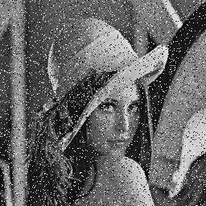
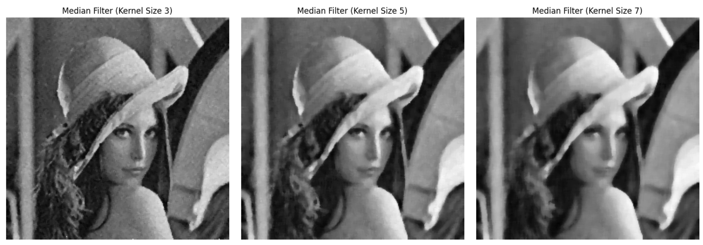
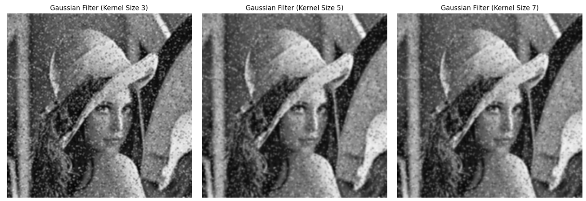

# Image_Enhancement_CVL_Assignment01
Comparison of Methods to Improve Noisy Image Quality by Filtering using Median, Gaussian and Average Filters with Various Kernel Size

### Step 1: Select an Image with Noise to be improved

The following image with size 256 x 256 is selected from a google search result: 

Step-by-step on applying filters to the selected image:

1. Load image and Convert to grayscale (using luminance 'L')
3. Create each respective filter function containing the following steps:
4. Apply the filter on selected image and display results

# Step 2: Create Filtering Functions

We will create functions for three filtering methods: 
1. Median filtering
2. Gaussian filtering
3. Average filtering

Create three functions for each filtering method containing the following
1. Validate kernel size, force it to be odd size kernel only
2. Define padding based on selected kernel size
3. Move filter kernel on padded image
4. Return new filtered image array value

### Step 3: Apply Filtering Functions using Various Kernel Size

Below are the results of each filtering methods on three different kernel sizes.

### Conclusion

Based on the visual analysis of the filtered images, the Median filter with a 3x3 kernel size appears to be the most effective among the tested kernel sizes (3x3, 5x5, and 7x7) for reducing noise in the selected image while preserving image edges. As the kernel size increased (from 3x3 to 5x5 and 7x7), the image became progressively blurrier, leading to a loss of fine details and edge definition. Therefore, for this particular noisy image, a smaller kernel size like 3x3 provides a better balance between noise removal and edge preservation when using the Median filter.
